<p align="center">
   <a href="https://codigrate.com">
      
   </a>
</p>

<h1 align="center">
Codigrate Color Palettes for macOS
</h1>

A carefully crafted collection of macOS color palettes inspired by nature and iconic cities around the world.
Each palette carries the signature colors of its Codigrate theme as a native macOS color list, so the exact
same colors you code with become available everywhere you design, write, and present.

## Getting Started

1. Download the **.clr** palette you want to use.
2. Copy it into **~/Library/Colors** (create the folder if it does not exist yet).
3. Open the system color picker in any app (in TextEdit press **Cmd+Shift+C**, or click any color well).
4. Switch to the **Palettes** tab and pick the Codigrate palette from the dropdown.

Or install from Terminal:

```bash
mkdir -p ~/Library/Colors && cp "Codigrate Aurora Borealis.clr" ~/Library/Colors/
```

## Notes

- Palettes work in every app that uses the native macOS color panel (Keynote, Pages, Numbers, Xcode, TextEdit, and more).
- Colors are stored in the sRGB color space, so they match the Codigrate theme hex values exactly.
- If the color panel is already open, close and reopen it after installing a palette.

## Nature

<p align="center">
   
</p>

<h1 align="center">
Aurora Borealis
</h1>

## Description

Inspired by the natural phenomena of the Aurora Borealis, this dark theme captures the majesty and mystery of the Arctic night sky. Dark blues and teals serve as the backdrop, while lighter accents echo the ethereal colors of the Northern Lights. The palette is designed to be easy on the eyes, helping you focus, and code efficiently.

## Screenshot

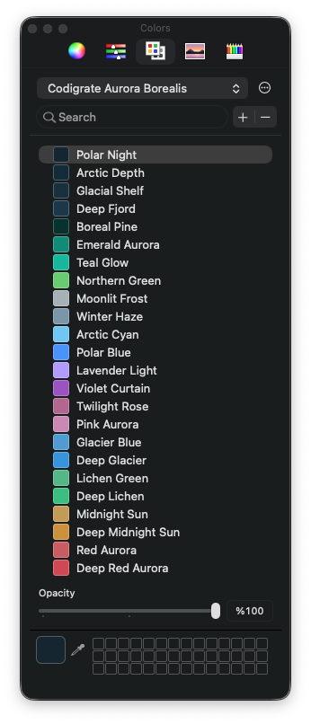

## Color Palette

<table>
   <tr>
      <td></td>
      <td>Polar Night</td>
      <td>#142B37</td>
   </tr>
   <tr>
      <td></td>
      <td>Arctic Depth</td>
      <td>#123243</td>
   </tr>
   <tr>
      <td></td>
      <td>Glacial Shelf</td>
      <td>#1A3746</td>
   </tr>
   <tr>
      <td></td>
      <td>Deep Fjord</td>
      <td>#1E3F53</td>
   </tr>
   <tr>
      <td></td>
      <td>Boreal Pine</td>
      <td>#043A33</td>
   </tr>
   <tr>
      <td></td>
      <td>Emerald Aurora</td>
      <td>#049682</td>
   </tr>
   <tr>
      <td></td>
      <td>Teal Glow</td>
      <td>#05C0A6</td>
   </tr>
   <tr>
      <td></td>
      <td>Northern Green</td>
      <td>#73D379</td>
   </tr>
   <tr>
      <td></td>
      <td>Moonlit Frost</td>
      <td>#B0B9BE</td>
   </tr>
   <tr>
      <td></td>
      <td>Winter Haze</td>
      <td>#85A2B3</td>
   </tr>
   <tr>
      <td></td>
      <td>Arctic Cyan</td>
      <td>#7ACEF5</td>
   </tr>
   <tr>
      <td></td>
      <td>Polar Blue</td>
      <td>#549EFF</td>
   </tr>
   <tr>
      <td></td>
      <td>Lavender Light</td>
      <td>#BAA5FF</td>
   </tr>
   <tr>
      <td></td>
      <td>Violet Curtain</td>
      <td>#A55CC8</td>
   </tr>
   <tr>
      <td></td>
      <td>Twilight Rose</td>
      <td>#BB719B</td>
   </tr>
   <tr>
      <td></td>
      <td>Pink Aurora</td>
      <td>#D193BB</td>
   </tr>
   <tr>
      <td></td>
      <td>Glacier Blue</td>
      <td>#5AA6DA</td>
   </tr>
   <tr>
      <td></td>
      <td>Deep Glacier</td>
      <td>#3EA0E3</td>
   </tr>
   <tr>
      <td></td>
      <td>Lichen Green</td>
      <td>#5BC093</td>
   </tr>
   <tr>
      <td></td>
      <td>Deep Lichen</td>
      <td>#3FC88B</td>
   </tr>
   <tr>
      <td></td>
      <td>Midnight Sun</td>
      <td>#CBA45E</td>
   </tr>
   <tr>
      <td></td>
      <td>Deep Midnight Sun</td>
      <td>#D49A3C</td>
   </tr>
   <tr>
      <td></td>
      <td>Red Aurora</td>
      <td>#D0636C</td>
   </tr>
   <tr>
      <td></td>
      <td>Deep Red Aurora</td>
      <td>#D74E5B</td>
   </tr>
</table>

---

<p align="center">
   
</p>

<h1 align="center">
Autumn
</h1>

## Description

Inspired by the warm hues and rustic feel of the autumn, this light theme aims to evoke a sense of comfort and tranquility. It blends soothing earth tones and crisp air-like whites, capturing the essence of fall leaves and late afternoon sunlight. The palette is designed to be gentle on the eyes, promoting focus and productivity.

## Screenshot

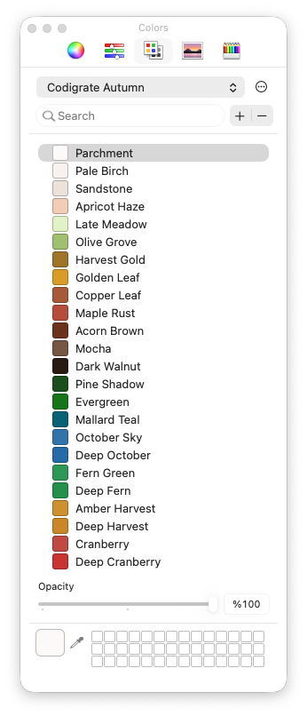

## Color Palette

<table>
   <tr>
      <td></td>
      <td>Parchment</td>
      <td>#FCFBFA</td>
   </tr>
   <tr>
      <td></td>
      <td>Pale Birch</td>
      <td>#F8F4F1</td>
   </tr>
   <tr>
      <td></td>
      <td>Sandstone</td>
      <td>#EFE6E0</td>
   </tr>
   <tr>
      <td></td>
      <td>Apricot Haze</td>
      <td>#F4D3BD</td>
   </tr>
   <tr>
      <td></td>
      <td>Late Meadow</td>
      <td>#E5F4CD</td>
   </tr>
   <tr>
      <td></td>
      <td>Olive Grove</td>
      <td>#A9C779</td>
   </tr>
   <tr>
      <td></td>
      <td>Harvest Gold</td>
      <td>#A87F25</td>
   </tr>
   <tr>
      <td></td>
      <td>Golden Leaf</td>
      <td>#DEA51D</td>
   </tr>
   <tr>
      <td></td>
      <td>Copper Leaf</td>
      <td>#B0633A</td>
   </tr>
   <tr>
      <td></td>
      <td>Maple Rust</td>
      <td>#BE553E</td>
   </tr>
   <tr>
      <td></td>
      <td>Acorn Brown</td>
      <td>#773918</td>
   </tr>
   <tr>
      <td></td>
      <td>Mocha</td>
      <td>#82614C</td>
   </tr>
   <tr>
      <td></td>
      <td>Dark Walnut</td>
      <td>#2E1B0F</td>
   </tr>
   <tr>
      <td></td>
      <td>Pine Shadow</td>
      <td>#1B591E</td>
   </tr>
   <tr>
      <td></td>
      <td>Evergreen</td>
      <td>#0E8113</td>
   </tr>
   <tr>
      <td></td>
      <td>Mallard Teal</td>
      <td>#006E83</td>
   </tr>
   <tr>
      <td></td>
      <td>October Sky</td>
      <td>#397FB7</td>
   </tr>
   <tr>
      <td></td>
      <td>Deep October</td>
      <td>#2876B4</td>
   </tr>
   <tr>
      <td></td>
      <td>Fern Green</td>
      <td>#30A25E</td>
   </tr>
   <tr>
      <td></td>
      <td>Deep Fern</td>
      <td>#219D53</td>
   </tr>
   <tr>
      <td></td>
      <td>Amber Harvest</td>
      <td>#D49A2A</td>
   </tr>
   <tr>
      <td></td>
      <td>Deep Harvest</td>
      <td>#D0921A</td>
   </tr>
   <tr>
      <td></td>
      <td>Cranberry</td>
      <td>#C8504A</td>
   </tr>
   <tr>
      <td></td>
      <td>Deep Cranberry</td>
      <td>#D0352D</td>
   </tr>
</table>

---

<p align="center">
   
</p>

<h1 align="center">
Etna
</h1>

## Description

Inspired by Mount Etna's nighttime eruptions, this dark theme builds on an ashen basalt grey base and layers in the incandescent reds, oranges, and golds of molten lava. The near-neutral charcoal surface keeps long sessions calm, while the warm lava accents draw the eye to what matters.

## Screenshot

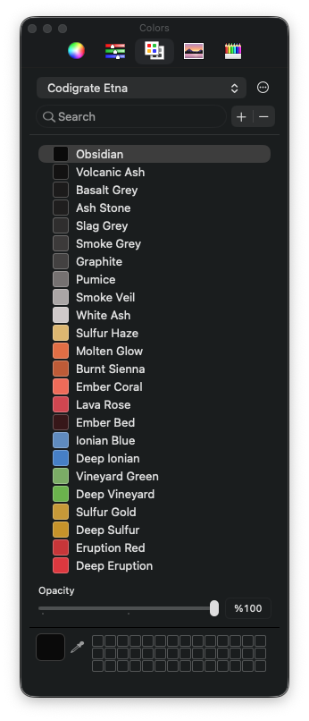

## Color Palette

<table>
   <tr>
      <td></td>
      <td>Obsidian</td>
      <td>#080808</td>
   </tr>
   <tr>
      <td></td>
      <td>Volcanic Ash</td>
      <td>#121111</td>
   </tr>
   <tr>
      <td></td>
      <td>Basalt Grey</td>
      <td>#1E1D1D</td>
   </tr>
   <tr>
      <td></td>
      <td>Ash Stone</td>
      <td>#222121</td>
   </tr>
   <tr>
      <td></td>
      <td>Slag Grey</td>
      <td>#363434</td>
   </tr>
   <tr>
      <td></td>
      <td>Smoke Grey</td>
      <td>#444242</td>
   </tr>
   <tr>
      <td></td>
      <td>Graphite</td>
      <td>#4C4A4A</td>
   </tr>
   <tr>
      <td></td>
      <td>Pumice</td>
      <td>#807C7C</td>
   </tr>
   <tr>
      <td></td>
      <td>Smoke Veil</td>
      <td>#B3AEAE</td>
   </tr>
   <tr>
      <td></td>
      <td>White Ash</td>
      <td>#D5CFCF</td>
   </tr>
   <tr>
      <td></td>
      <td>Sulfur Haze</td>
      <td>#E2BF79</td>
   </tr>
   <tr>
      <td></td>
      <td>Molten Glow</td>
      <td>#E67748</td>
   </tr>
   <tr>
      <td></td>
      <td>Burnt Sienna</td>
      <td>#C66439</td>
   </tr>
   <tr>
      <td></td>
      <td>Ember Coral</td>
      <td>#F1735F</td>
   </tr>
   <tr>
      <td></td>
      <td>Lava Rose</td>
      <td>#D74C57</td>
   </tr>
   <tr>
      <td></td>
      <td>Ember Bed</td>
      <td>#3F171A</td>
   </tr>
   <tr>
      <td></td>
      <td>Ionian Blue</td>
      <td>#6A96C8</td>
   </tr>
   <tr>
      <td></td>
      <td>Deep Ionian</td>
      <td>#4F8BCF</td>
   </tr>
   <tr>
      <td></td>
      <td>Vineyard Green</td>
      <td>#85B66F</td>
   </tr>
   <tr>
      <td></td>
      <td>Deep Vineyard</td>
      <td>#75BC54</td>
   </tr>
   <tr>
      <td></td>
      <td>Sulfur Gold</td>
      <td>#CDA337</td>
   </tr>
   <tr>
      <td></td>
      <td>Deep Sulfur</td>
      <td>#CD9D23</td>
   </tr>
   <tr>
      <td></td>
      <td>Eruption Red</td>
      <td>#CF383C</td>
   </tr>
   <tr>
      <td></td>
      <td>Deep Eruption</td>
      <td>#E23A42</td>
   </tr>
</table>

---

<p align="center">
   
</p>

<h1 align="center">
Everest
</h1>

## Description

Inspired by the majestic heights and serene landscapes of Mount Everest, this light theme aims to provide a calming and focused coding environment. The soft blues and grays mimic the icy terrains, while subtle hints of warmer colors evoke the golden hues of dawn breaking over snow-capped peaks.

## Screenshot

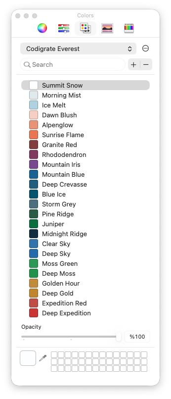

## Color Palette

<table>
   <tr>
      <td></td>
      <td>Summit Snow</td>
      <td>#FDFEFF</td>
   </tr>
   <tr>
      <td></td>
      <td>Morning Mist</td>
      <td>#E4ECEF</td>
   </tr>
   <tr>
      <td></td>
      <td>Ice Melt</td>
      <td>#B6D8E5</td>
   </tr>
   <tr>
      <td></td>
      <td>Dawn Blush</td>
      <td>#F6D4C8</td>
   </tr>
   <tr>
      <td></td>
      <td>Alpenglow</td>
      <td>#EC9C81</td>
   </tr>
   <tr>
      <td></td>
      <td>Sunrise Flame</td>
      <td>#ED7E5A</td>
   </tr>
   <tr>
      <td></td>
      <td>Granite Red</td>
      <td>#8F4446</td>
   </tr>
   <tr>
      <td></td>
      <td>Rhododendron</td>
      <td>#8C4069</td>
   </tr>
   <tr>
      <td></td>
      <td>Mountain Iris</td>
      <td>#83529B</td>
   </tr>
   <tr>
      <td></td>
      <td>Mountain Blue</td>
      <td>#1A6D9F</td>
   </tr>
   <tr>
      <td></td>
      <td>Deep Crevasse</td>
      <td>#246A89</td>
   </tr>
   <tr>
      <td></td>
      <td>Blue Ice</td>
      <td>#005E79</td>
   </tr>
   <tr>
      <td></td>
      <td>Storm Grey</td>
      <td>#567B8A</td>
   </tr>
   <tr>
      <td></td>
      <td>Pine Ridge</td>
      <td>#2E674F</td>
   </tr>
   <tr>
      <td></td>
      <td>Juniper</td>
      <td>#007A47</td>
   </tr>
   <tr>
      <td></td>
      <td>Midnight Ridge</td>
      <td>#0E3448</td>
   </tr>
   <tr>
      <td></td>
      <td>Clear Sky</td>
      <td>#397FB7</td>
   </tr>
   <tr>
      <td></td>
      <td>Deep Sky</td>
      <td>#2876B4</td>
   </tr>
   <tr>
      <td></td>
      <td>Moss Green</td>
      <td>#30A25E</td>
   </tr>
   <tr>
      <td></td>
      <td>Deep Moss</td>
      <td>#219D53</td>
   </tr>
   <tr>
      <td></td>
      <td>Golden Hour</td>
      <td>#C8963E</td>
   </tr>
   <tr>
      <td></td>
      <td>Deep Gold</td>
      <td>#C98F28</td>
   </tr>
   <tr>
      <td></td>
      <td>Expedition Red</td>
      <td>#C8534E</td>
   </tr>
   <tr>
      <td></td>
      <td>Deep Expedition</td>
      <td>#D13731</td>
   </tr>
</table>

---

<p align="center">
   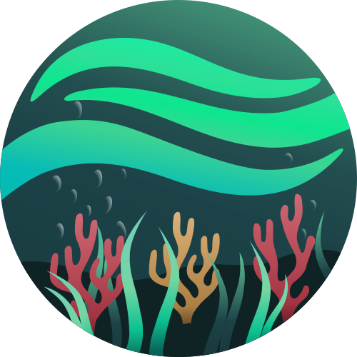
</p>

<h1 align="center">
Ocean
</h1>

## Description


## Screenshot

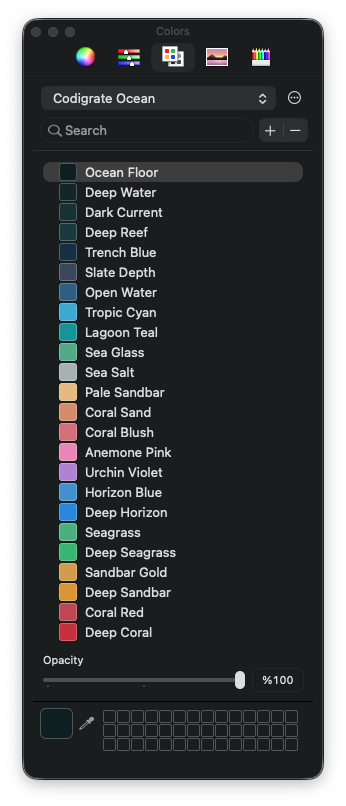

## Color Palette

<table>
   <tr>
      <td></td>
      <td>Ocean Floor</td>
      <td>#0B2225</td>
   </tr>
   <tr>
      <td></td>
      <td>Deep Water</td>
      <td>#102B2E</td>
   </tr>
   <tr>
      <td></td>
      <td>Dark Current</td>
      <td>#18383C</td>
   </tr>
   <tr>
      <td></td>
      <td>Deep Reef</td>
      <td>#1C4247</td>
   </tr>
   <tr>
      <td></td>
      <td>Trench Blue</td>
      <td>#14364D</td>
   </tr>
   <tr>
      <td></td>
      <td>Slate Depth</td>
      <td>#425064</td>
   </tr>
   <tr>
      <td></td>
      <td>Open Water</td>
      <td>#33698E</td>
   </tr>
   <tr>
      <td></td>
      <td>Tropic Cyan</td>
      <td>#3FB4D8</td>
   </tr>
   <tr>
      <td></td>
      <td>Lagoon Teal</td>
      <td>#0BA0A5</td>
   </tr>
   <tr>
      <td></td>
      <td>Sea Glass</td>
      <td>#5AB590</td>
   </tr>
   <tr>
      <td></td>
      <td>Sea Salt</td>
      <td>#AFBABD</td>
   </tr>
   <tr>
      <td></td>
      <td>Pale Sandbar</td>
      <td>#EAC089</td>
   </tr>
   <tr>
      <td></td>
      <td>Coral Sand</td>
      <td>#DC9577</td>
   </tr>
   <tr>
      <td></td>
      <td>Coral Blush</td>
      <td>#DC7783</td>
   </tr>
   <tr>
      <td></td>
      <td>Anemone Pink</td>
      <td>#EE8EBF</td>
   </tr>
   <tr>
      <td></td>
      <td>Urchin Violet</td>
      <td>#B88BDA</td>
   </tr>
   <tr>
      <td></td>
      <td>Horizon Blue</td>
      <td>#4A9BD8</td>
   </tr>
   <tr>
      <td></td>
      <td>Deep Horizon</td>
      <td>#2C94E2</td>
   </tr>
   <tr>
      <td></td>
      <td>Seagrass</td>
      <td>#52BA88</td>
   </tr>
   <tr>
      <td></td>
      <td>Deep Seagrass</td>
      <td>#39BF7E</td>
   </tr>
   <tr>
      <td></td>
      <td>Sandbar Gold</td>
      <td>#D6A44E</td>
   </tr>
   <tr>
      <td></td>
      <td>Deep Sandbar</td>
      <td>#DF9F30</td>
   </tr>
   <tr>
      <td></td>
      <td>Coral Red</td>
      <td>#C74D5C</td>
   </tr>
   <tr>
      <td></td>
      <td>Deep Coral</td>
      <td>#D02F43</td>
   </tr>
</table>

---

<p align="center">
   
</p>

<h1 align="center">
Reynisfjara
</h1>

## Description


## Screenshot

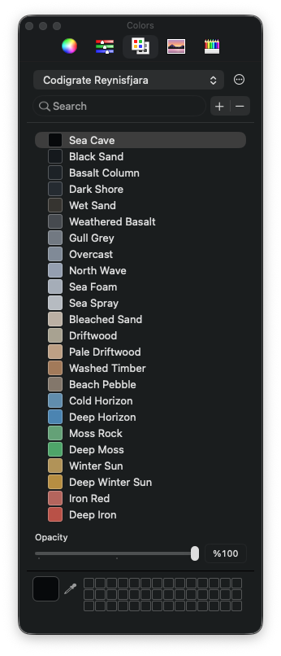

## Color Palette

<table>
   <tr>
      <td></td>
      <td>Sea Cave</td>
      <td>#060709</td>
   </tr>
   <tr>
      <td></td>
      <td>Black Sand</td>
      <td>#151A20</td>
   </tr>
   <tr>
      <td></td>
      <td>Basalt Column</td>
      <td>#20262C</td>
   </tr>
   <tr>
      <td></td>
      <td>Dark Shore</td>
      <td>#2A3138</td>
   </tr>
   <tr>
      <td></td>
      <td>Wet Sand</td>
      <td>#3E3B37</td>
   </tr>
   <tr>
      <td></td>
      <td>Weathered Basalt</td>
      <td>#4F545A</td>
   </tr>
   <tr>
      <td></td>
      <td>Gull Grey</td>
      <td>#7D848D</td>
   </tr>
   <tr>
      <td></td>
      <td>Overcast</td>
      <td>#8B95A2</td>
   </tr>
   <tr>
      <td></td>
      <td>North Wave</td>
      <td>#9FA9B9</td>
   </tr>
   <tr>
      <td></td>
      <td>Sea Foam</td>
      <td>#AEB6C0</td>
   </tr>
   <tr>
      <td></td>
      <td>Sea Spray</td>
      <td>#BEC3C8</td>
   </tr>
   <tr>
      <td></td>
      <td>Bleached Sand</td>
      <td>#C3B9AD</td>
   </tr>
   <tr>
      <td></td>
      <td>Driftwood</td>
      <td>#B1AC9B</td>
   </tr>
   <tr>
      <td></td>
      <td>Pale Driftwood</td>
      <td>#C5A98F</td>
   </tr>
   <tr>
      <td></td>
      <td>Washed Timber</td>
      <td>#AC8563</td>
   </tr>
   <tr>
      <td></td>
      <td>Beach Pebble</td>
      <td>#8E8276</td>
   </tr>
   <tr>
      <td></td>
      <td>Cold Horizon</td>
      <td>#6C98B7</td>
   </tr>
   <tr>
      <td></td>
      <td>Deep Horizon</td>
      <td>#5490BB</td>
   </tr>
   <tr>
      <td></td>
      <td>Moss Rock</td>
      <td>#6EAB82</td>
   </tr>
   <tr>
      <td></td>
      <td>Deep Moss</td>
      <td>#56AF73</td>
   </tr>
   <tr>
      <td></td>
      <td>Winter Sun</td>
      <td>#BA9D5F</td>
   </tr>
   <tr>
      <td></td>
      <td>Deep Winter Sun</td>
      <td>#BF9846</td>
   </tr>
   <tr>
      <td></td>
      <td>Iron Red</td>
      <td>#BD6F66</td>
   </tr>
   <tr>
      <td></td>
      <td>Deep Iron</td>
      <td>#C2594D</td>
   </tr>
</table>

---

<p align="center">
   
</p>

<h1 align="center">
Roraima
</h1>

## Description

Inspired by the captivating sunset over Mount Roraima, this dark theme seamlessly blends the deep twilight hues of blues and purples with the fiery brilliance of oranges and yellows. Evoking the serene majesty of Roraima as day transitions to night, this balanced palette offers a soothing yet invigorating backdrop, ensuring an optimal and focused coding experience.

## Screenshot

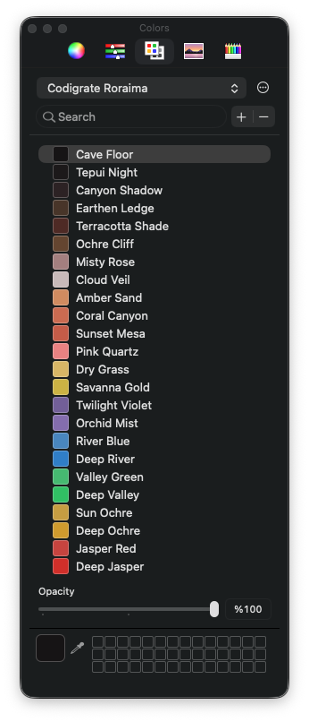

## Color Palette

<table>
   <tr>
      <td></td>
      <td>Cave Floor</td>
      <td>#171415</td>
   </tr>
   <tr>
      <td></td>
      <td>Tepui Night</td>
      <td>#1E1A1B</td>
   </tr>
   <tr>
      <td></td>
      <td>Canyon Shadow</td>
      <td>#322628</td>
   </tr>
   <tr>
      <td></td>
      <td>Earthen Ledge</td>
      <td>#523C2D</td>
   </tr>
   <tr>
      <td></td>
      <td>Terracotta Shade</td>
      <td>#582F29</td>
   </tr>
   <tr>
      <td></td>
      <td>Ochre Cliff</td>
      <td>#6F4E35</td>
   </tr>
   <tr>
      <td></td>
      <td>Misty Rose</td>
      <td>#AD8A8A</td>
   </tr>
   <tr>
      <td></td>
      <td>Cloud Veil</td>
      <td>#CEC1C1</td>
   </tr>
   <tr>
      <td></td>
      <td>Amber Sand</td>
      <td>#D69568</td>
   </tr>
   <tr>
      <td></td>
      <td>Coral Canyon</td>
      <td>#D17458</td>
   </tr>
   <tr>
      <td></td>
      <td>Sunset Mesa</td>
      <td>#CC654E</td>
   </tr>
   <tr>
      <td></td>
      <td>Pink Quartz</td>
      <td>#ED8B8B</td>
   </tr>
   <tr>
      <td></td>
      <td>Dry Grass</td>
      <td>#DDBE6D</td>
   </tr>
   <tr>
      <td></td>
      <td>Savanna Gold</td>
      <td>#D1BA46</td>
   </tr>
   <tr>
      <td></td>
      <td>Twilight Violet</td>
      <td>#7E6AA3</td>
   </tr>
   <tr>
      <td></td>
      <td>Orchid Mist</td>
      <td>#8F78B7</td>
   </tr>
   <tr>
      <td></td>
      <td>River Blue</td>
      <td>#5292C7</td>
   </tr>
   <tr>
      <td></td>
      <td>Deep River</td>
      <td>#358AD0</td>
   </tr>
   <tr>
      <td></td>
      <td>Valley Green</td>
      <td>#4CC27B</td>
   </tr>
   <tr>
      <td></td>
      <td>Deep Valley</td>
      <td>#32C86E</td>
   </tr>
   <tr>
      <td></td>
      <td>Sun Ochre</td>
      <td>#CDA644</td>
   </tr>
   <tr>
      <td></td>
      <td>Deep Ochre</td>
      <td>#D5A427</td>
   </tr>
   <tr>
      <td></td>
      <td>Jasper Red</td>
      <td>#CE4A44</td>
   </tr>
   <tr>
      <td></td>
      <td>Deep Jasper</td>
      <td>#D72E27</td>
   </tr>
</table>

---

<p align="center">
   
</p>

<h1 align="center">
Sakura
</h1>

## Description

Inspired by the enchanting allure of Sakura blossoms, this theme encapsulates the soft, calming essence of spring. Delicate pinks serve as the backdrop, representing the blossoms, while muted greens and blues act as complementary accents, reflecting the tranquil garden and clear sky. The palette, akin to a serene, blooming Sakura garden, is designed to be easy on the eyes, aiding focus and efficient coding.

## Screenshot

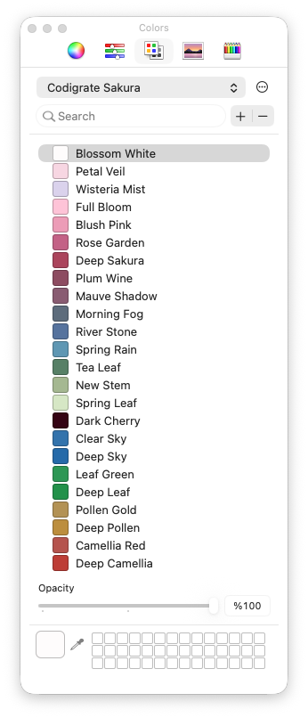

## Color Palette

<table>
   <tr>
      <td></td>
      <td>Blossom White</td>
      <td>#FEFCFC</td>
   </tr>
   <tr>
      <td></td>
      <td>Petal Veil</td>
      <td>#F8DBE6</td>
   </tr>
   <tr>
      <td></td>
      <td>Wisteria Mist</td>
      <td>#DFD7EF</td>
   </tr>
   <tr>
      <td></td>
      <td>Full Bloom</td>
      <td>#FFC9DC</td>
   </tr>
   <tr>
      <td></td>
      <td>Blush Pink</td>
      <td>#EFA5BF</td>
   </tr>
   <tr>
      <td></td>
      <td>Rose Garden</td>
      <td>#CB6B91</td>
   </tr>
   <tr>
      <td></td>
      <td>Deep Sakura</td>
      <td>#B54B66</td>
   </tr>
   <tr>
      <td></td>
      <td>Plum Wine</td>
      <td>#98556C</td>
   </tr>
   <tr>
      <td></td>
      <td>Mauve Shadow</td>
      <td>#94667D</td>
   </tr>
   <tr>
      <td></td>
      <td>Morning Fog</td>
      <td>#687788</td>
   </tr>
   <tr>
      <td></td>
      <td>River Stone</td>
      <td>#607FA9</td>
   </tr>
   <tr>
      <td></td>
      <td>Spring Rain</td>
      <td>#69A2BD</td>
   </tr>
   <tr>
      <td></td>
      <td>Tea Leaf</td>
      <td>#618C71</td>
   </tr>
   <tr>
      <td></td>
      <td>New Stem</td>
      <td>#AEC09B</td>
   </tr>
   <tr>
      <td></td>
      <td>Spring Leaf</td>
      <td>#DBEACB</td>
   </tr>
   <tr>
      <td></td>
      <td>Dark Cherry</td>
      <td>#3D0013</td>
   </tr>
   <tr>
      <td></td>
      <td>Clear Sky</td>
      <td>#397FB7</td>
   </tr>
   <tr>
      <td></td>
      <td>Deep Sky</td>
      <td>#2876B4</td>
   </tr>
   <tr>
      <td></td>
      <td>Leaf Green</td>
      <td>#30A25E</td>
   </tr>
   <tr>
      <td></td>
      <td>Deep Leaf</td>
      <td>#219D53</td>
   </tr>
   <tr>
      <td></td>
      <td>Pollen Gold</td>
      <td>#BC9C5C</td>
   </tr>
   <tr>
      <td></td>
      <td>Deep Pollen</td>
      <td>#C49840</td>
   </tr>
   <tr>
      <td></td>
      <td>Camellia Red</td>
      <td>#BE5C55</td>
   </tr>
   <tr>
      <td></td>
      <td>Deep Camellia</td>
      <td>#C64238</td>
   </tr>
</table>

---

<p align="center">
   
</p>

<h1 align="center">
Salda
</h1>

## Description


## Screenshot

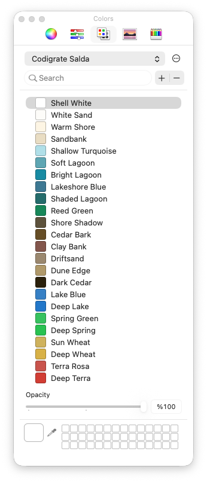

## Color Palette

<table>
   <tr>
      <td></td>
      <td>Shell White</td>
      <td>#FFFFFF</td>
   </tr>
   <tr>
      <td></td>
      <td>White Sand</td>
      <td>#FDFCFA</td>
   </tr>
   <tr>
      <td></td>
      <td>Warm Shore</td>
      <td>#FDF6E7</td>
   </tr>
   <tr>
      <td></td>
      <td>Sandbank</td>
      <td>#ECE1C9</td>
   </tr>
   <tr>
      <td></td>
      <td>Shallow Turquoise</td>
      <td>#B8E4EC</td>
   </tr>
   <tr>
      <td></td>
      <td>Soft Lagoon</td>
      <td>#68B0BC</td>
   </tr>
   <tr>
      <td></td>
      <td>Bright Lagoon</td>
      <td>#1397AE</td>
   </tr>
   <tr>
      <td></td>
      <td>Lakeshore Blue</td>
      <td>#44849F</td>
   </tr>
   <tr>
      <td></td>
      <td>Shaded Lagoon</td>
      <td>#277878</td>
   </tr>
   <tr>
      <td></td>
      <td>Reed Green</td>
      <td>#0F9363</td>
   </tr>
   <tr>
      <td></td>
      <td>Shore Shadow</td>
      <td>#685C43</td>
   </tr>
   <tr>
      <td></td>
      <td>Cedar Bark</td>
      <td>#715827</td>
   </tr>
   <tr>
      <td></td>
      <td>Clay Bank</td>
      <td>#8F6055</td>
   </tr>
   <tr>
      <td></td>
      <td>Driftsand</td>
      <td>#A59379</td>
   </tr>
   <tr>
      <td></td>
      <td>Dune Edge</td>
      <td>#B9A373</td>
   </tr>
   <tr>
      <td></td>
      <td>Dark Cedar</td>
      <td>#312408</td>
   </tr>
   <tr>
      <td></td>
      <td>Lake Blue</td>
      <td>#3C8CCE</td>
   </tr>
   <tr>
      <td></td>
      <td>Deep Lake</td>
      <td>#2483D2</td>
   </tr>
   <tr>
      <td></td>
      <td>Spring Green</td>
      <td>#3ACA68</td>
   </tr>
   <tr>
      <td></td>
      <td>Deep Spring</td>
      <td>#26CA5A</td>
   </tr>
   <tr>
      <td></td>
      <td>Sun Wheat</td>
      <td>#D5BA63</td>
   </tr>
   <tr>
      <td></td>
      <td>Deep Wheat</td>
      <td>#DDB947</td>
   </tr>
   <tr>
      <td></td>
      <td>Terra Rosa</td>
      <td>#D05B52</td>
   </tr>
   <tr>
      <td></td>
      <td>Deep Terra</td>
      <td>#D94035</td>
   </tr>
</table>

---

<p align="center">
   
</p>

<h1 align="center">
Sequoia
</h1>

## Description

Inspired by the towering presence and serene environment of sequoias, it envelops your IDE in deep blacks and browns, providing a calm and focused coding atmosphere. Accents of vibrant green illuminate the interface subtly, mirroring the vitality of these magnificent trees. Venture into the digital woods, and let its grounded, tranquil palette guide you through the logical forest of your code efficiently.

## Screenshot

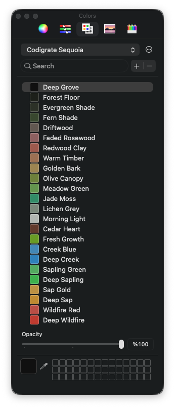

## Color Palette

<table>
   <tr>
      <td></td>
      <td>Deep Grove</td>
      <td>#0E0E0E</td>
   </tr>
   <tr>
      <td></td>
      <td>Forest Floor</td>
      <td>#20231C</td>
   </tr>
   <tr>
      <td></td>
      <td>Evergreen Shade</td>
      <td>#32382C</td>
   </tr>
   <tr>
      <td></td>
      <td>Fern Shade</td>
      <td>#405133</td>
   </tr>
   <tr>
      <td></td>
      <td>Driftwood</td>
      <td>#6C625A</td>
   </tr>
   <tr>
      <td></td>
      <td>Faded Rosewood</td>
      <td>#986969</td>
   </tr>
   <tr>
      <td></td>
      <td>Redwood Clay</td>
      <td>#A86255</td>
   </tr>
   <tr>
      <td></td>
      <td>Warm Timber</td>
      <td>#A67B5B</td>
   </tr>
   <tr>
      <td></td>
      <td>Golden Bark</td>
      <td>#A68F59</td>
   </tr>
   <tr>
      <td></td>
      <td>Olive Canopy</td>
      <td>#788B40</td>
   </tr>
   <tr>
      <td></td>
      <td>Meadow Green</td>
      <td>#6E9F56</td>
   </tr>
   <tr>
      <td></td>
      <td>Jade Moss</td>
      <td>#369772</td>
   </tr>
   <tr>
      <td></td>
      <td>Lichen Grey</td>
      <td>#849184</td>
   </tr>
   <tr>
      <td></td>
      <td>Morning Light</td>
      <td>#BABEBA</td>
   </tr>
   <tr>
      <td></td>
      <td>Cedar Heart</td>
      <td>#6D4130</td>
   </tr>
   <tr>
      <td></td>
      <td>Fresh Growth</td>
      <td>#73A621</td>
   </tr>
   <tr>
      <td></td>
      <td>Creek Blue</td>
      <td>#4A93C0</td>
   </tr>
   <tr>
      <td></td>
      <td>Deep Creek</td>
      <td>#328CC4</td>
   </tr>
   <tr>
      <td></td>
      <td>Sapling Green</td>
      <td>#5CB36A</td>
   </tr>
   <tr>
      <td></td>
      <td>Deep Sapling</td>
      <td>#42B955</td>
   </tr>
   <tr>
      <td></td>
      <td>Sap Gold</td>
      <td>#C39A45</td>
   </tr>
   <tr>
      <td></td>
      <td>Deep Sap</td>
      <td>#C6942E</td>
   </tr>
   <tr>
      <td></td>
      <td>Wildfire Red</td>
      <td>#C2564B</td>
   </tr>
   <tr>
      <td></td>
      <td>Deep Wildfire</td>
      <td>#C73F31</td>
   </tr>
</table>

---

<p align="center">
   
</p>

<h1 align="center">
Spring
</h1>

## Description


## Screenshot

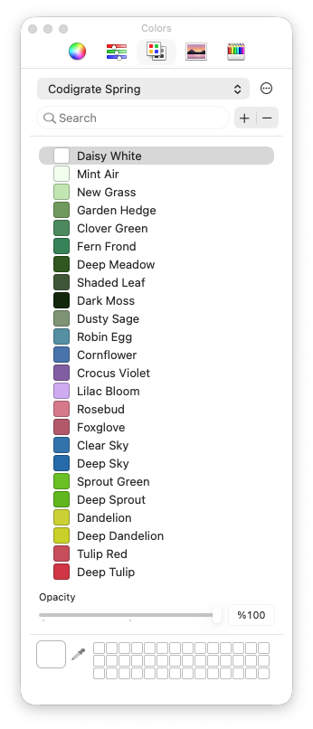

## Color Palette

<table>
   <tr>
      <td></td>
      <td>Daisy White</td>
      <td>#FFFFFF</td>
   </tr>
   <tr>
      <td></td>
      <td>Mint Air</td>
      <td>#F4FFF1</td>
   </tr>
   <tr>
      <td></td>
      <td>New Grass</td>
      <td>#C8EAB9</td>
   </tr>
   <tr>
      <td></td>
      <td>Garden Hedge</td>
      <td>#7BA566</td>
   </tr>
   <tr>
      <td></td>
      <td>Clover Green</td>
      <td>#559569</td>
   </tr>
   <tr>
      <td></td>
      <td>Fern Frond</td>
      <td>#3C8F63</td>
   </tr>
   <tr>
      <td></td>
      <td>Deep Meadow</td>
      <td>#356220</td>
   </tr>
   <tr>
      <td></td>
      <td>Shaded Leaf</td>
      <td>#49613F</td>
   </tr>
   <tr>
      <td></td>
      <td>Dark Moss</td>
      <td>#122C07</td>
   </tr>
   <tr>
      <td></td>
      <td>Dusty Sage</td>
      <td>#8A9E80</td>
   </tr>
   <tr>
      <td></td>
      <td>Robin Egg</td>
      <td>#5E9AAE</td>
   </tr>
   <tr>
      <td></td>
      <td>Cornflower</td>
      <td>#527FB6</td>
   </tr>
   <tr>
      <td></td>
      <td>Crocus Violet</td>
      <td>#8C68AC</td>
   </tr>
   <tr>
      <td></td>
      <td>Lilac Bloom</td>
      <td>#D5B3F4</td>
   </tr>
   <tr>
      <td></td>
      <td>Rosebud</td>
      <td>#DC8395</td>
   </tr>
   <tr>
      <td></td>
      <td>Foxglove</td>
      <td>#BA6173</td>
   </tr>
   <tr>
      <td></td>
      <td>Clear Sky</td>
      <td>#397FB7</td>
   </tr>
   <tr>
      <td></td>
      <td>Deep Sky</td>
      <td>#2876B4</td>
   </tr>
   <tr>
      <td></td>
      <td>Sprout Green</td>
      <td>#73C71A</td>
   </tr>
   <tr>
      <td></td>
      <td>Deep Sprout</td>
      <td>#69C00C</td>
   </tr>
   <tr>
      <td></td>
      <td>Dandelion</td>
      <td>#D1D72C</td>
   </tr>
   <tr>
      <td></td>
      <td>Deep Dandelion</td>
      <td>#CFD619</td>
   </tr>
   <tr>
      <td></td>
      <td>Tulip Red</td>
      <td>#CE5563</td>
   </tr>
   <tr>
      <td></td>
      <td>Deep Tulip</td>
      <td>#D7384A</td>
   </tr>
</table>

## Cities

<p align="center">
   
</p>

<h1 align="center">
Istanbul
</h1>

## Description

Inspired by the soft daylight and sea breezes of Istanbul, this theme blends calm turquoise tones with warm historical accents to create a serene yet expressive coding environment. Light, airy backgrounds keep the editor clean and comfortable, while teals, aquas, and muted golden hues add clarity and focus to essential syntax elements.

## Screenshot

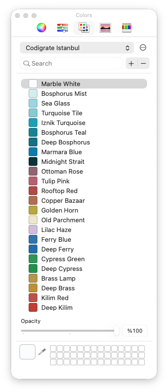

## Color Palette

<table>
   <tr>
      <td></td>
      <td>Marble White</td>
      <td>#FAFDFD</td>
   </tr>
   <tr>
      <td></td>
      <td>Bosphorus Mist</td>
      <td>#DBF0F1</td>
   </tr>
   <tr>
      <td></td>
      <td>Sea Glass</td>
      <td>#A3DDE5</td>
   </tr>
   <tr>
      <td></td>
      <td>Turquoise Tile</td>
      <td>#91D1DA</td>
   </tr>
   <tr>
      <td></td>
      <td>Iznik Turquoise</td>
      <td>#12ACC1</td>
   </tr>
   <tr>
      <td></td>
      <td>Bosphorus Teal</td>
      <td>#1190A1</td>
   </tr>
   <tr>
      <td></td>
      <td>Deep Bosphorus</td>
      <td>#087E8E</td>
   </tr>
   <tr>
      <td></td>
      <td>Marmara Blue</td>
      <td>#0887B5</td>
   </tr>
   <tr>
      <td></td>
      <td>Midnight Strait</td>
      <td>#083A41</td>
   </tr>
   <tr>
      <td></td>
      <td>Ottoman Rose</td>
      <td>#9C6E7C</td>
   </tr>
   <tr>
      <td></td>
      <td>Tulip Pink</td>
      <td>#C16979</td>
   </tr>
   <tr>
      <td></td>
      <td>Rooftop Red</td>
      <td>#B8514D</td>
   </tr>
   <tr>
      <td></td>
      <td>Copper Bazaar</td>
      <td>#B87958</td>
   </tr>
   <tr>
      <td></td>
      <td>Golden Horn</td>
      <td>#C0AF43</td>
   </tr>
   <tr>
      <td></td>
      <td>Old Parchment</td>
      <td>#EFEAD0</td>
   </tr>
   <tr>
      <td></td>
      <td>Lilac Haze</td>
      <td>#D5C5E1</td>
   </tr>
   <tr>
      <td></td>
      <td>Ferry Blue</td>
      <td>#397FB7</td>
   </tr>
   <tr>
      <td></td>
      <td>Deep Ferry</td>
      <td>#2876B4</td>
   </tr>
   <tr>
      <td></td>
      <td>Cypress Green</td>
      <td>#30A25E</td>
   </tr>
   <tr>
      <td></td>
      <td>Deep Cypress</td>
      <td>#219D53</td>
   </tr>
   <tr>
      <td></td>
      <td>Brass Lamp</td>
      <td>#BDA051</td>
   </tr>
   <tr>
      <td></td>
      <td>Deep Brass</td>
      <td>#C39D37</td>
   </tr>
   <tr>
      <td></td>
      <td>Kilim Red</td>
      <td>#C15C53</td>
   </tr>
   <tr>
      <td></td>
      <td>Deep Kilim</td>
      <td>#CA4236</td>
   </tr>
</table>

---

<p align="center">
   
</p>

<h1 align="center">
Madrid
</h1>

## Description


## Screenshot

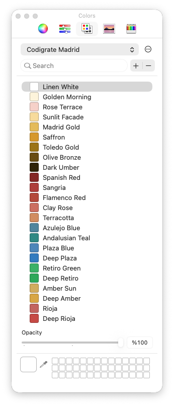

## Color Palette

<table>
   <tr>
      <td></td>
      <td>Linen White</td>
      <td>#FFFFFF</td>
   </tr>
   <tr>
      <td></td>
      <td>Golden Morning</td>
      <td>#FDF5DF</td>
   </tr>
   <tr>
      <td></td>
      <td>Rose Terrace</td>
      <td>#F8D6CF</td>
   </tr>
   <tr>
      <td></td>
      <td>Sunlit Facade</td>
      <td>#F8DFA3</td>
   </tr>
   <tr>
      <td></td>
      <td>Madrid Gold</td>
      <td>#E8C25D</td>
   </tr>
   <tr>
      <td></td>
      <td>Saffron</td>
      <td>#DCA225</td>
   </tr>
   <tr>
      <td></td>
      <td>Toledo Gold</td>
      <td>#A57F02</td>
   </tr>
   <tr>
      <td></td>
      <td>Olive Bronze</td>
      <td>#745606</td>
   </tr>
   <tr>
      <td></td>
      <td>Dark Umber</td>
      <td>#372805</td>
   </tr>
   <tr>
      <td></td>
      <td>Spanish Red</td>
      <td>#902926</td>
   </tr>
   <tr>
      <td></td>
      <td>Sangria</td>
      <td>#B84440</td>
   </tr>
   <tr>
      <td></td>
      <td>Flamenco Red</td>
      <td>#BD503F</td>
   </tr>
   <tr>
      <td></td>
      <td>Clay Rose</td>
      <td>#D37969</td>
   </tr>
   <tr>
      <td></td>
      <td>Terracotta</td>
      <td>#D79668</td>
   </tr>
   <tr>
      <td></td>
      <td>Azulejo Blue</td>
      <td>#5A91A8</td>
   </tr>
   <tr>
      <td></td>
      <td>Andalusian Teal</td>
      <td>#349590</td>
   </tr>
   <tr>
      <td></td>
      <td>Plaza Blue</td>
      <td>#5692C3</td>
   </tr>
   <tr>
      <td></td>
      <td>Deep Plaza</td>
      <td>#3887C8</td>
   </tr>
   <tr>
      <td></td>
      <td>Retiro Green</td>
      <td>#40BB71</td>
   </tr>
   <tr>
      <td></td>
      <td>Deep Retiro</td>
      <td>#2FB263</td>
   </tr>
   <tr>
      <td></td>
      <td>Amber Sun</td>
      <td>#D8B564</td>
   </tr>
   <tr>
      <td></td>
      <td>Deep Amber</td>
      <td>#DDAF46</td>
   </tr>
   <tr>
      <td></td>
      <td>Rioja</td>
      <td>#CA6D68</td>
   </tr>
   <tr>
      <td></td>
      <td>Deep Rioja</td>
      <td>#CE514B</td>
   </tr>
</table>

---

<p align="center">
   
</p>

<h1 align="center">
Miami
</h1>

## Description

Inspired by the electric nights and pastel sunsets of Miami, this theme blends deep purples with vibrant neon accents to create a bold yet balanced coding environment. Dark, warm backgrounds ground the editor, while vivid pinks, corals, and tropical teals bring energy and clarity to key syntax elements.

## Screenshot

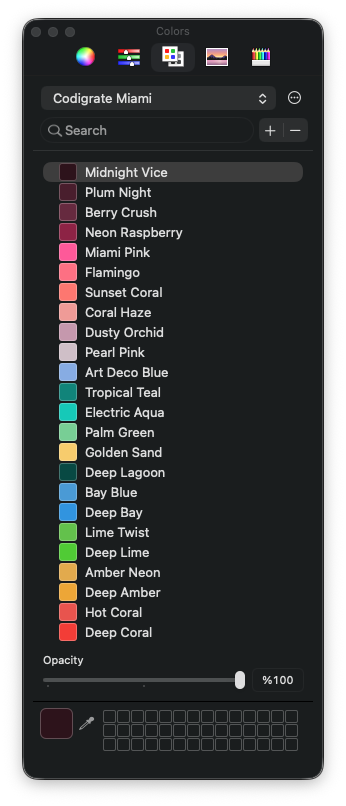

## Color Palette

<table>
   <tr>
      <td></td>
      <td>Midnight Vice</td>
      <td>#33121D</td>
   </tr>
   <tr>
      <td></td>
      <td>Plum Night</td>
      <td>#532033</td>
   </tr>
   <tr>
      <td></td>
      <td>Berry Crush</td>
      <td>#722E47</td>
   </tr>
   <tr>
      <td></td>
      <td>Neon Raspberry</td>
      <td>#99224D</td>
   </tr>
   <tr>
      <td></td>
      <td>Miami Pink</td>
      <td>#FF5FA2</td>
   </tr>
   <tr>
      <td></td>
      <td>Flamingo</td>
      <td>#FE788C</td>
   </tr>
   <tr>
      <td></td>
      <td>Sunset Coral</td>
      <td>#FE8078</td>
   </tr>
   <tr>
      <td></td>
      <td>Coral Haze</td>
      <td>#F2A4A0</td>
   </tr>
   <tr>
      <td></td>
      <td>Dusty Orchid</td>
      <td>#CCA2B6</td>
   </tr>
   <tr>
      <td></td>
      <td>Pearl Pink</td>
      <td>#D5C6CE</td>
   </tr>
   <tr>
      <td></td>
      <td>Art Deco Blue</td>
      <td>#92B5E8</td>
   </tr>
   <tr>
      <td></td>
      <td>Tropical Teal</td>
      <td>#059086</td>
   </tr>
   <tr>
      <td></td>
      <td>Electric Aqua</td>
      <td>#00D1C1</td>
   </tr>
   <tr>
      <td></td>
      <td>Palm Green</td>
      <td>#82D59F</td>
   </tr>
   <tr>
      <td></td>
      <td>Golden Sand</td>
      <td>#F8D273</td>
   </tr>
   <tr>
      <td></td>
      <td>Deep Lagoon</td>
      <td>#03534D</td>
   </tr>
   <tr>
      <td></td>
      <td>Bay Blue</td>
      <td>#53A5DC</td>
   </tr>
   <tr>
      <td></td>
      <td>Deep Bay</td>
      <td>#369FE5</td>
   </tr>
   <tr>
      <td></td>
      <td>Lime Twist</td>
      <td>#6CC952</td>
   </tr>
   <tr>
      <td></td>
      <td>Deep Lime</td>
      <td>#57D235</td>
   </tr>
   <tr>
      <td></td>
      <td>Amber Neon</td>
      <td>#E6B250</td>
   </tr>
   <tr>
      <td></td>
      <td>Deep Amber</td>
      <td>#F0AE32</td>
   </tr>
   <tr>
      <td></td>
      <td>Hot Coral</td>
      <td>#EC5B54</td>
   </tr>
   <tr>
      <td></td>
      <td>Deep Coral</td>
      <td>#F63F36</td>
   </tr>
</table>

---

<p align="center">
   
</p>

<h1 align="center">
Paris
</h1>

## Description

Inspired by elegant boulevards and Paris’s sunset glow, this theme trades bright champagne for dusty rose accents over calm plum-espresso tones. Soft dark editor backgrounds keep focus clear, while mauve surfaces and wine-tinted hovers add depth and balance, with a gentle blush accent guiding attention across the interface.

## Screenshot

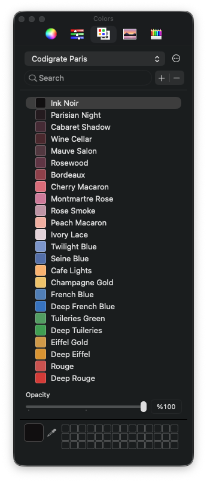

## Color Palette

<table>
   <tr>
      <td></td>
      <td>Ink Noir</td>
      <td>#100D0E</td>
   </tr>
   <tr>
      <td></td>
      <td>Parisian Night</td>
      <td>#281D22</td>
   </tr>
   <tr>
      <td></td>
      <td>Cabaret Shadow</td>
      <td>#4F303C</td>
   </tr>
   <tr>
      <td></td>
      <td>Wine Cellar</td>
      <td>#532D33</td>
   </tr>
   <tr>
      <td></td>
      <td>Mauve Salon</td>
      <td>#5D3F49</td>
   </tr>
   <tr>
      <td></td>
      <td>Rosewood</td>
      <td>#6A3C4D</td>
   </tr>
   <tr>
      <td></td>
      <td>Bordeaux</td>
      <td>#994753</td>
   </tr>
   <tr>
      <td></td>
      <td>Cherry Macaron</td>
      <td>#DF7583</td>
   </tr>
   <tr>
      <td></td>
      <td>Montmartre Rose</td>
      <td>#D584A3</td>
   </tr>
   <tr>
      <td></td>
      <td>Rose Smoke</td>
      <td>#C79FAE</td>
   </tr>
   <tr>
      <td></td>
      <td>Peach Macaron</td>
      <td>#F3B7A9</td>
   </tr>
   <tr>
      <td></td>
      <td>Ivory Lace</td>
      <td>#E6D7DD</td>
   </tr>
   <tr>
      <td></td>
      <td>Twilight Blue</td>
      <td>#87A1D3</td>
   </tr>
   <tr>
      <td></td>
      <td>Seine Blue</td>
      <td>#5E7BB3</td>
   </tr>
   <tr>
      <td></td>
      <td>Cafe Lights</td>
      <td>#FBBA77</td>
   </tr>
   <tr>
      <td></td>
      <td>Champagne Gold</td>
      <td>#F1C970</td>
   </tr>
   <tr>
      <td></td>
      <td>French Blue</td>
      <td>#5A8AC0</td>
   </tr>
   <tr>
      <td></td>
      <td>Deep French Blue</td>
      <td>#3E7FC8</td>
   </tr>
   <tr>
      <td></td>
      <td>Tuileries Green</td>
      <td>#5CA86C</td>
   </tr>
   <tr>
      <td></td>
      <td>Deep Tuileries</td>
      <td>#46A95B</td>
   </tr>
   <tr>
      <td></td>
      <td>Eiffel Gold</td>
      <td>#D5A24C</td>
   </tr>
   <tr>
      <td></td>
      <td>Deep Eiffel</td>
      <td>#DE9D2E</td>
   </tr>
   <tr>
      <td></td>
      <td>Rouge</td>
      <td>#D15A56</td>
   </tr>
   <tr>
      <td></td>
      <td>Deep Rouge</td>
      <td>#DA3E39</td>
   </tr>
</table>

---

<p align="center">
   
</p>

<h1 align="center">
Prague
</h1>

## Description


## Screenshot

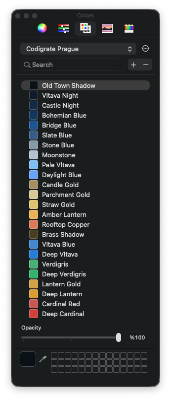

## Color Palette

<table>
   <tr>
      <td></td>
      <td>Old Town Shadow</td>
      <td>#070F17</td>
   </tr>
   <tr>
      <td></td>
      <td>Vltava Night</td>
      <td>#0D1D2E</td>
   </tr>
   <tr>
      <td></td>
      <td>Castle Night</td>
      <td>#123151</td>
   </tr>
   <tr>
      <td></td>
      <td>Bohemian Blue</td>
      <td>#113E6B</td>
   </tr>
   <tr>
      <td></td>
      <td>Bridge Blue</td>
      <td>#1E5FA0</td>
   </tr>
   <tr>
      <td></td>
      <td>Slate Blue</td>
      <td>#3E6895</td>
   </tr>
   <tr>
      <td></td>
      <td>Stone Blue</td>
      <td>#92A3B3</td>
   </tr>
   <tr>
      <td></td>
      <td>Moonstone</td>
      <td>#BBC9D7</td>
   </tr>
   <tr>
      <td></td>
      <td>Pale Vltava</td>
      <td>#89C5F8</td>
   </tr>
   <tr>
      <td></td>
      <td>Daylight Blue</td>
      <td>#74ADF8</td>
   </tr>
   <tr>
      <td></td>
      <td>Candle Gold</td>
      <td>#B0986C</td>
   </tr>
   <tr>
      <td></td>
      <td>Parchment Gold</td>
      <td>#DCCF9D</td>
   </tr>
   <tr>
      <td></td>
      <td>Straw Gold</td>
      <td>#E3CA77</td>
   </tr>
   <tr>
      <td></td>
      <td>Amber Lantern</td>
      <td>#EFBA5A</td>
   </tr>
   <tr>
      <td></td>
      <td>Rooftop Copper</td>
      <td>#DF865B</td>
   </tr>
   <tr>
      <td></td>
      <td>Brass Shadow</td>
      <td>#544723</td>
   </tr>
   <tr>
      <td></td>
      <td>Vltava Blue</td>
      <td>#4A93D8</td>
   </tr>
   <tr>
      <td></td>
      <td>Deep Vltava</td>
      <td>#2C89E2</td>
   </tr>
   <tr>
      <td></td>
      <td>Verdigris</td>
      <td>#4FBA80</td>
   </tr>
   <tr>
      <td></td>
      <td>Deep Verdigris</td>
      <td>#37BD75</td>
   </tr>
   <tr>
      <td></td>
      <td>Lantern Gold</td>
      <td>#D8A94A</td>
   </tr>
   <tr>
      <td></td>
      <td>Deep Lantern</td>
      <td>#E2A52C</td>
   </tr>
   <tr>
      <td></td>
      <td>Cardinal Red</td>
      <td>#D0605C</td>
   </tr>
   <tr>
      <td></td>
      <td>Deep Cardinal</td>
      <td>#D8453F</td>
   </tr>
</table>

---

<p align="center">
   
</p>

<h1 align="center">
Rio de Janeiro
</h1>

## Description

Inspired by Rio's lush hills, soft morning light, and ocean air, this theme blends airy minty backgrounds with confident rainforest greens and clean coastal blues. The editor stays bright and calm for long sessions, while crisp greens and balanced accents keep syntax readable and focused.

## Screenshot

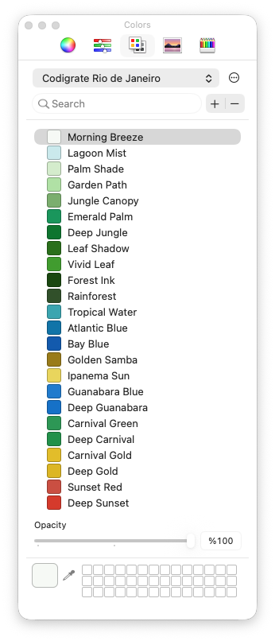

## Color Palette

<table>
   <tr>
      <td></td>
      <td>Morning Breeze</td>
      <td>#F7FAF6</td>
   </tr>
   <tr>
      <td></td>
      <td>Lagoon Mist</td>
      <td>#D0ECEF</td>
   </tr>
   <tr>
      <td></td>
      <td>Palm Shade</td>
      <td>#D9EFD2</td>
   </tr>
   <tr>
      <td></td>
      <td>Garden Path</td>
      <td>#B8E5AD</td>
   </tr>
   <tr>
      <td></td>
      <td>Jungle Canopy</td>
      <td>#85B778</td>
   </tr>
   <tr>
      <td></td>
      <td>Emerald Palm</td>
      <td>#13A166</td>
   </tr>
   <tr>
      <td></td>
      <td>Deep Jungle</td>
      <td>#028134</td>
   </tr>
   <tr>
      <td></td>
      <td>Leaf Shadow</td>
      <td>#2D7B18</td>
   </tr>
   <tr>
      <td></td>
      <td>Vivid Leaf</td>
      <td>#47A731</td>
   </tr>
   <tr>
      <td></td>
      <td>Forest Ink</td>
      <td>#1A510A</td>
   </tr>
   <tr>
      <td></td>
      <td>Rainforest</td>
      <td>#375B2E</td>
   </tr>
   <tr>
      <td></td>
      <td>Tropical Water</td>
      <td>#41AFBA</td>
   </tr>
   <tr>
      <td></td>
      <td>Atlantic Blue</td>
      <td>#0A80B3</td>
   </tr>
   <tr>
      <td></td>
      <td>Bay Blue</td>
      <td>#1065B8</td>
   </tr>
   <tr>
      <td></td>
      <td>Golden Samba</td>
      <td>#A3860A</td>
   </tr>
   <tr>
      <td></td>
      <td>Ipanema Sun</td>
      <td>#ECDA61</td>
   </tr>
   <tr>
      <td></td>
      <td>Guanabara Blue</td>
      <td>#2287D5</td>
   </tr>
   <tr>
      <td></td>
      <td>Deep Guanabara</td>
      <td>#137DD0</td>
   </tr>
   <tr>
      <td></td>
      <td>Carnival Green</td>
      <td>#30A25E</td>
   </tr>
   <tr>
      <td></td>
      <td>Deep Carnival</td>
      <td>#219D53</td>
   </tr>
   <tr>
      <td></td>
      <td>Carnival Gold</td>
      <td>#E6C41A</td>
   </tr>
   <tr>
      <td></td>
      <td>Deep Gold</td>
      <td>#E1BE0A</td>
   </tr>
   <tr>
      <td></td>
      <td>Sunset Red</td>
      <td>#D15647</td>
   </tr>
   <tr>
      <td></td>
      <td>Deep Sunset</td>
      <td>#DB3C29</td>
   </tr>
</table>

---

<p align="center">
   
</p>

<h1 align="center">
Sydney
</h1>

## Description


## Screenshot

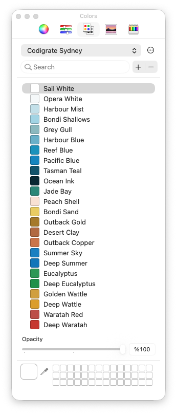

## Color Palette

<table>
   <tr>
      <td></td>
      <td>Sail White</td>
      <td>#FFFFFF</td>
   </tr>
   <tr>
      <td></td>
      <td>Opera White</td>
      <td>#F6F9FA</td>
   </tr>
   <tr>
      <td></td>
      <td>Harbour Mist</td>
      <td>#CAE4EC</td>
   </tr>
   <tr>
      <td></td>
      <td>Bondi Shallows</td>
      <td>#ABDAE8</td>
   </tr>
   <tr>
      <td></td>
      <td>Grey Gull</td>
      <td>#96C1C7</td>
   </tr>
   <tr>
      <td></td>
      <td>Harbour Blue</td>
      <td>#73B9D0</td>
   </tr>
   <tr>
      <td></td>
      <td>Reef Blue</td>
      <td>#169DC5</td>
   </tr>
   <tr>
      <td></td>
      <td>Pacific Blue</td>
      <td>#0F91C7</td>
   </tr>
   <tr>
      <td></td>
      <td>Tasman Teal</td>
      <td>#0E5E76</td>
   </tr>
   <tr>
      <td></td>
      <td>Ocean Ink</td>
      <td>#062E3A</td>
   </tr>
   <tr>
      <td></td>
      <td>Jade Bay</td>
      <td>#2F9383</td>
   </tr>
   <tr>
      <td></td>
      <td>Peach Shell</td>
      <td>#FAE5D9</td>
   </tr>
   <tr>
      <td></td>
      <td>Bondi Sand</td>
      <td>#ECD268</td>
   </tr>
   <tr>
      <td></td>
      <td>Outback Gold</td>
      <td>#AF8427</td>
   </tr>
   <tr>
      <td></td>
      <td>Desert Clay</td>
      <td>#BA7347</td>
   </tr>
   <tr>
      <td></td>
      <td>Outback Copper</td>
      <td>#D17F51</td>
   </tr>
   <tr>
      <td></td>
      <td>Summer Sky</td>
      <td>#178BCA</td>
   </tr>
   <tr>
      <td></td>
      <td>Deep Summer</td>
      <td>#0A82C3</td>
   </tr>
   <tr>
      <td></td>
      <td>Eucalyptus</td>
      <td>#30A25E</td>
   </tr>
   <tr>
      <td></td>
      <td>Deep Eucalyptus</td>
      <td>#219D53</td>
   </tr>
   <tr>
      <td></td>
      <td>Golden Wattle</td>
      <td>#D6A840</td>
   </tr>
   <tr>
      <td></td>
      <td>Deep Wattle</td>
      <td>#E0A621</td>
   </tr>
   <tr>
      <td></td>
      <td>Waratah Red</td>
      <td>#C5564E</td>
   </tr>
   <tr>
      <td></td>
      <td>Deep Waratah</td>
      <td>#CE3B31</td>
   </tr>
</table>

---

<p align="center">
   
</p>

<h1 align="center">
Tallinn
</h1>

## Description

Inspired by Tallinn's crisp light and Baltic calm, this theme pairs airy porcelain backgrounds with cool Nordic blues for a clean, focused coding experience. Soft, bright surfaces enhance readability, while deep ink accents and subtle lavender-rose highlights add clarity and warmth without losing the chill vibe.

## Screenshot

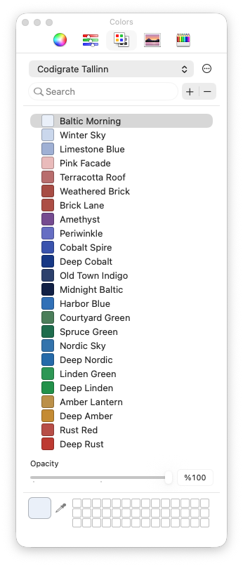

## Color Palette

<table>
   <tr>
      <td></td>
      <td>Baltic Morning</td>
      <td>#EDF2FA</td>
   </tr>
   <tr>
      <td></td>
      <td>Winter Sky</td>
      <td>#D0DCEF</td>
   </tr>
   <tr>
      <td></td>
      <td>Limestone Blue</td>
      <td>#A9B9DA</td>
   </tr>
   <tr>
      <td></td>
      <td>Pink Facade</td>
      <td>#ECC2C2</td>
   </tr>
   <tr>
      <td></td>
      <td>Terracotta Roof</td>
      <td>#C17777</td>
   </tr>
   <tr>
      <td></td>
      <td>Weathered Brick</td>
      <td>#B1544B</td>
   </tr>
   <tr>
      <td></td>
      <td>Brick Lane</td>
      <td>#B6564B</td>
   </tr>
   <tr>
      <td></td>
      <td>Amethyst</td>
      <td>#81549C</td>
   </tr>
   <tr>
      <td></td>
      <td>Periwinkle</td>
      <td>#7179CC</td>
   </tr>
   <tr>
      <td></td>
      <td>Cobalt Spire</td>
      <td>#425EB8</td>
   </tr>
   <tr>
      <td></td>
      <td>Deep Cobalt</td>
      <td>#184092</td>
   </tr>
   <tr>
      <td></td>
      <td>Old Town Indigo</td>
      <td>#324979</td>
   </tr>
   <tr>
      <td></td>
      <td>Midnight Baltic</td>
      <td>#0F244F</td>
   </tr>
   <tr>
      <td></td>
      <td>Harbor Blue</td>
      <td>#377CC1</td>
   </tr>
   <tr>
      <td></td>
      <td>Courtyard Green</td>
      <td>#548A64</td>
   </tr>
   <tr>
      <td></td>
      <td>Spruce Green</td>
      <td>#1E7857</td>
   </tr>
   <tr>
      <td></td>
      <td>Nordic Sky</td>
      <td>#397FB7</td>
   </tr>
   <tr>
      <td></td>
      <td>Deep Nordic</td>
      <td>#2876B4</td>
   </tr>
   <tr>
      <td></td>
      <td>Linden Green</td>
      <td>#30A25E</td>
   </tr>
   <tr>
      <td></td>
      <td>Deep Linden</td>
      <td>#219D53</td>
   </tr>
   <tr>
      <td></td>
      <td>Amber Lantern</td>
      <td>#C39A4E</td>
   </tr>
   <tr>
      <td></td>
      <td>Deep Amber</td>
      <td>#CB9532</td>
   </tr>
   <tr>
      <td></td>
      <td>Rust Red</td>
      <td>#C0564E</td>
   </tr>
   <tr>
      <td></td>
      <td>Deep Rust</td>
      <td>#C63E34</td>
   </tr>
</table>

---

<p align="center">
   
</p>

<h1 align="center">
Tokyo
</h1>

## Description

Inspired by Tokyo's neon-lit side streets, midnight skylines, and the quiet glow of lantern-lined alleys, this theme blends deep indigo shadows with electric violet highlights to create a sleek, futuristic coding atmosphere. Moody blues keep the editor calm and focused, while luminous purples, soft lilacs, and crisp cyan accents add clarity and energy to key syntax elements.

## Screenshot

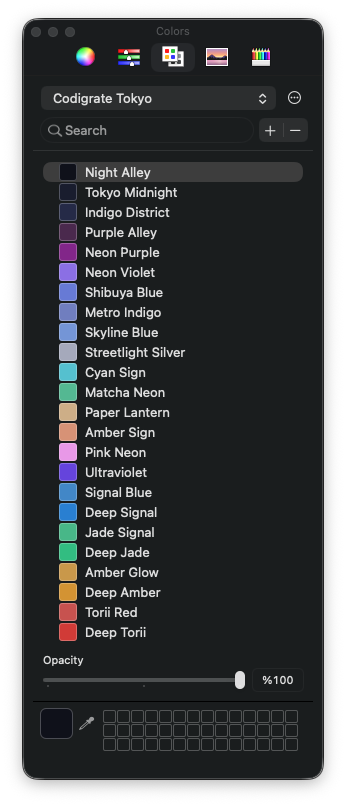

## Color Palette

<table>
   <tr>
      <td></td>
      <td>Night Alley</td>
      <td>#0C0F1C</td>
   </tr>
   <tr>
      <td></td>
      <td>Tokyo Midnight</td>
      <td>#1A1F35</td>
   </tr>
   <tr>
      <td></td>
      <td>Indigo District</td>
      <td>#2A3051</td>
   </tr>
   <tr>
      <td></td>
      <td>Purple Alley</td>
      <td>#542D58</td>
   </tr>
   <tr>
      <td></td>
      <td>Neon Purple</td>
      <td>#8E2795</td>
   </tr>
   <tr>
      <td></td>
      <td>Neon Violet</td>
      <td>#967AEA</td>
   </tr>
   <tr>
      <td></td>
      <td>Shibuya Blue</td>
      <td>#7285DC</td>
   </tr>
   <tr>
      <td></td>
      <td>Metro Indigo</td>
      <td>#7B89C8</td>
   </tr>
   <tr>
      <td></td>
      <td>Skyline Blue</td>
      <td>#7FA0DD</td>
   </tr>
   <tr>
      <td></td>
      <td>Streetlight Silver</td>
      <td>#AEB2C3</td>
   </tr>
   <tr>
      <td></td>
      <td>Cyan Sign</td>
      <td>#5DC8D6</td>
   </tr>
   <tr>
      <td></td>
      <td>Matcha Neon</td>
      <td>#5CC19D</td>
   </tr>
   <tr>
      <td></td>
      <td>Paper Lantern</td>
      <td>#D3B690</td>
   </tr>
   <tr>
      <td></td>
      <td>Amber Sign</td>
      <td>#DD9B7F</td>
   </tr>
   <tr>
      <td></td>
      <td>Pink Neon</td>
      <td>#ECA1EB</td>
   </tr>
   <tr>
      <td></td>
      <td>Ultraviolet</td>
      <td>#714CE3</td>
   </tr>
   <tr>
      <td></td>
      <td>Signal Blue</td>
      <td>#4A93D0</td>
   </tr>
   <tr>
      <td></td>
      <td>Deep Signal</td>
      <td>#2C8BD9</td>
   </tr>
   <tr>
      <td></td>
      <td>Jade Signal</td>
      <td>#4FC093</td>
   </tr>
   <tr>
      <td></td>
      <td>Deep Jade</td>
      <td>#34C68C</td>
   </tr>
   <tr>
      <td></td>
      <td>Amber Glow</td>
      <td>#D0A24E</td>
   </tr>
   <tr>
      <td></td>
      <td>Deep Amber</td>
      <td>#D99D30</td>
   </tr>
   <tr>
      <td></td>
      <td>Torii Red</td>
      <td>#CF5A56</td>
   </tr>
   <tr>
      <td></td>
      <td>Deep Torii</td>
      <td>#D83E39</td>
   </tr>
</table>

---

<p align="center">
   
</p>

<h1 align="center">
Vienna
</h1>

## Description


## Screenshot

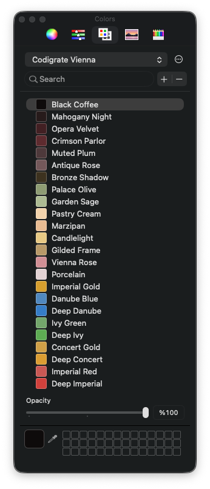

## Color Palette

<table>
   <tr>
      <td></td>
      <td>Black Coffee</td>
      <td>#0B0909</td>
   </tr>
   <tr>
      <td></td>
      <td>Mahogany Night</td>
      <td>#2C1D1D</td>
   </tr>
   <tr>
      <td></td>
      <td>Opera Velvet</td>
      <td>#4B2226</td>
   </tr>
   <tr>
      <td></td>
      <td>Crimson Parlor</td>
      <td>#6A2F34</td>
   </tr>
   <tr>
      <td></td>
      <td>Muted Plum</td>
      <td>#584143</td>
   </tr>
   <tr>
      <td></td>
      <td>Antique Rose</td>
      <td>#806264</td>
   </tr>
   <tr>
      <td></td>
      <td>Bronze Shadow</td>
      <td>#463921</td>
   </tr>
   <tr>
      <td></td>
      <td>Palace Olive</td>
      <td>#98A67D</td>
   </tr>
   <tr>
      <td></td>
      <td>Garden Sage</td>
      <td>#B6C39C</td>
   </tr>
   <tr>
      <td></td>
      <td>Pastry Cream</td>
      <td>#F4D8B3</td>
   </tr>
   <tr>
      <td></td>
      <td>Marzipan</td>
      <td>#ECC39A</td>
   </tr>
   <tr>
      <td></td>
      <td>Candlelight</td>
      <td>#EACF8C</td>
   </tr>
   <tr>
      <td></td>
      <td>Gilded Frame</td>
      <td>#C0A371</td>
   </tr>
   <tr>
      <td></td>
      <td>Vienna Rose</td>
      <td>#D7999F</td>
   </tr>
   <tr>
      <td></td>
      <td>Porcelain</td>
      <td>#E6D7D8</td>
   </tr>
   <tr>
      <td></td>
      <td>Imperial Gold</td>
      <td>#DCA826</td>
   </tr>
   <tr>
      <td></td>
      <td>Danube Blue</td>
      <td>#5A93C8</td>
   </tr>
   <tr>
      <td></td>
      <td>Deep Danube</td>
      <td>#3D89D0</td>
   </tr>
   <tr>
      <td></td>
      <td>Ivy Green</td>
      <td>#7DB075</td>
   </tr>
   <tr>
      <td></td>
      <td>Deep Ivy</td>
      <td>#67B65B</td>
   </tr>
   <tr>
      <td></td>
      <td>Concert Gold</td>
      <td>#D6A94A</td>
   </tr>
   <tr>
      <td></td>
      <td>Deep Concert</td>
      <td>#E0A62C</td>
   </tr>
   <tr>
      <td></td>
      <td>Imperial Red</td>
      <td>#D0605C</td>
   </tr>
   <tr>
      <td></td>
      <td>Deep Imperial</td>
      <td>#D8453F</td>
   </tr>
</table>
